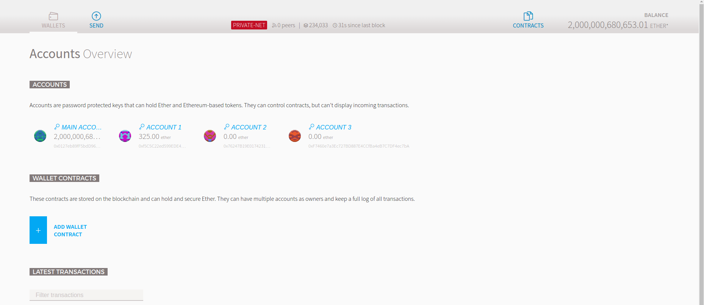
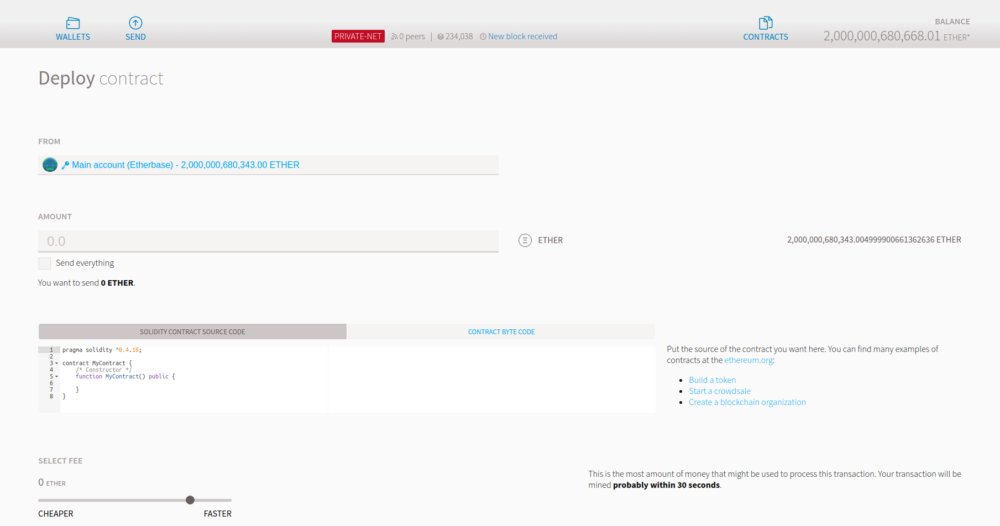
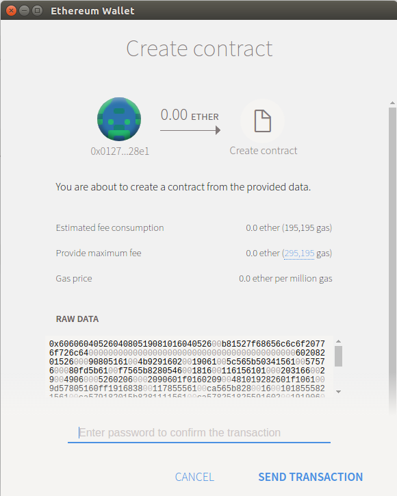
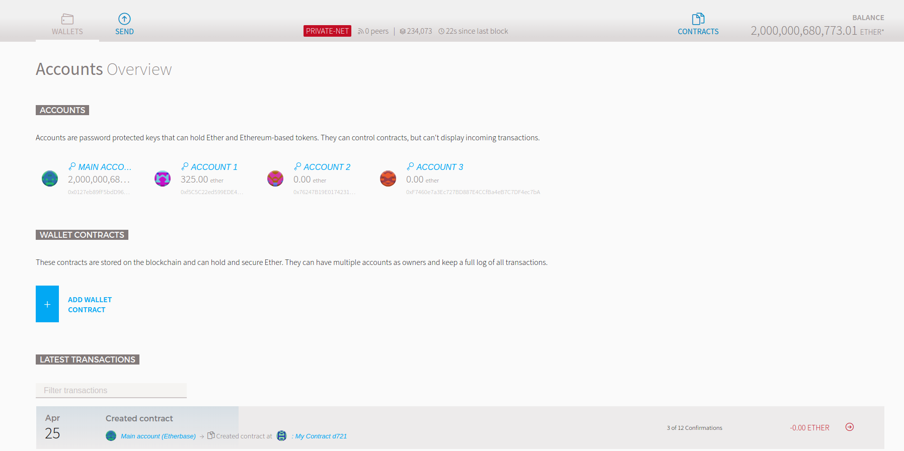
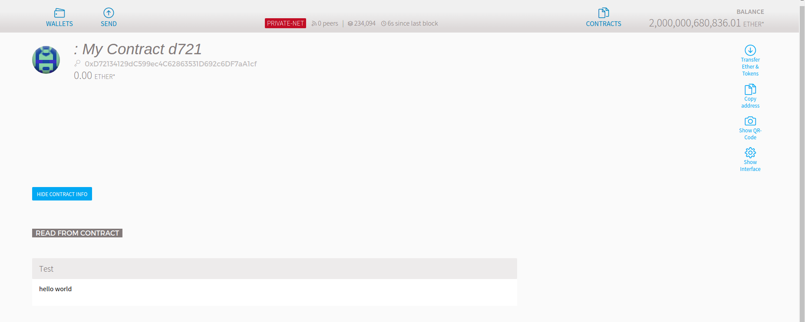

# 搭建以太坊私链/运行智能合约

## 私链搭建（基于ubuntu，geth（以太坊go客户端））

### 安装geth

#### 下载安装包
进入[包下载地址](https://geth.ethereum.org/downloads/)后，下载linux版本。

解压安装包
```bash
tar zxvf geth-linux-amd64-1.8.6-12683fec.tar.gz //注意将文件名替换成你下载名称
cd geth-linux-amd64-1.8.6-12683fec  //进入目录
sudo mv geth /usr/local/bin   //将命令移动到/usr/local/bin，可以直接在终端geth调用命令；需管理员权限
```


#### PPA安装(建议)
```bash
sudo apt-get install software-properties-common
sudo add-apt-repository -y ppa:ethereum/ethereum
sudo apt-get update
sudo apt-get install ethereum
```
成功安装后，运行geth --help可以出现命令行提示

#### 编译源码/安装（建议）
```bash
git clone https://github.com/ethereum/go-ethereum
```
编译go-ethereum需要安装go1.7或以上版本，c编译器

安装geth
```bash
make geth
```

安装所有命令
```bash
make all
```
生成的所以命令均在$go-ethereum/build/bin  

#### docker安装
首先安装docker，可以参考[docker ce安装教程](https://docs.docker.com/install/linux/docker-ce/ubuntu/)
```bash
docker pull ethereum/client-go
```

完成后，可以运行以docker方式运行以太坊客户端。

### 生成创世块genesis.json
源码编译时，会生成puppeth命令，可以直接使用该命令生成创世块配置文件（可以直接改动当前目录下的genesis.json）。  
```bash
cd build/bin //进入puppeth命令所在目录
./puppeth  //运行命令


+-----------------------------------------------------------+
| Welcome to puppeth, your Ethereum private network manager |
|                                                           |
| This tool lets you create a new Ethereum network down to  |
| the genesis block, bootnodes, miners and ethstats servers |
| without the hassle that it would normally entail.         |
|                                                           |
| Puppeth uses SSH to dial in to remote servers, and builds |
| its network components out of Docker containers using the |
| docker-compose toolset.                                   |
+-----------------------------------------------------------+

Please specify a network name to administer (no spaces, please)
> test  //测试网络名称

Sweet, you can set this via --network=test next time!

INFO [04-24|16:53:18] Administering Ethereum network           name=test
WARN [04-24|16:53:18] No previous configurations found         path=/home/ubuntu/.puppeth/test

What would you like to do? (default = stats)
 1. Show network stats     //显示网络状态
 2. Configure new genesis  //配置新的创世块
 3. Track new remote server //追踪远程服务器
 4. Deploy network components //发布网络组件
> 2

Which consensus engine to use? (default = clique)
 1. Ethash - proof-of-work      //工作量证明共识算法（主网使用共识算法）
 2. Clique - proof-of-authority  //POA共识算法，RINEKBY测试网使用
> 1

Which accounts should be pre-funded? (advisable at least one) //预先往账户中打资金
> 0x829BD824B016326A401d083B33D092293333A830
> 0x

Specify your chain/network ID if you want an explicit one (default = random)
> 2055   //唯一的网络标识
INFO [04-24|16:54:25] Configured new genesis block 

What would you like to do? (default = stats)
 1. Show network stats      //同上
 2. Manage existing genesis  //管理当前创世块
 3. Track new remote server  //同上
 4. Deploy network components //同上
> 2

 1. Modify existing fork rules   //修改当前规则
 2. Export genesis configuration  //导出当前配置
 3. Remove genesis configuration  //删除当前配置
> 2

Which file to save the genesis into? (default = test.json)
> genesis.json   //创世块文件名
INFO [04-24|16:54:45] Exported existing genesis block 

What would you like to do? (default = stats)
 1. Show network stats
 2. Manage existing genesis
 3. Track new remote server
 4. Deploy network components
> ^C    //Ctrl+C 退出

```
命令完成后，将在当前目录生成[genesis.json文件](./genesis.json),可对文件进行修改，如删除alloc中不需要的部分。

### 运行以太坊私链
初始化创世块
```bash
geth --datadir yourdir init genesis.json   // yourdir是存储链数据的目录，genesis.json是创建的创世块配置文件
```
运行私链节点
```bash
geth --datadir youdir --networkid 2055 --rpc console // 2055需与genesis.json中一致；开启rpc服务
```
挖矿
```bash
// 创建账户；123为账户密码；会在keystore下生成加密后的私钥文件
// 已有账户可以跳过该步骤
personnal.newAccount("123")

//开启一个线程挖矿，只有挖矿才能将交易打包进块;
//必须设置了ethbase或当前节点下有账户方可进行挖矿；
miner.start(1) 
```

输出应类似：
```bash
INFO [04-25|08:49:41] Commit new mining work                   number=233821 txs=0 uncles=0 elapsed=345.104µs
INFO [04-25|08:50:14] Successfully sealed new block            number=233821 hash=5da70e…fcfcd3
INFO [04-25|08:50:14] 🔗 block reached canonical chain          number=233816 hash=a461a0…029ce0
INFO [04-25|08:50:14] 🔨 mined potential block                  number=233821 hash=5da70e…fcfcd3
INFO [04-25|08:50:14] Commit new mining work                   number=233822 txs=0 uncles=0 elapsed=255.58µs
```
至此，以太坊私链已搭建完成。添加其他节点/挖矿belows。

### 添加其他节点/与节点进行交互
添加新节点：
1.使用另一台机器或虚拟机，安装好geth
2.使用当前机器，但端口需配置，否则会造成冲突
以第一种方式为例：
a：在该节点初始化创世块
b：启动节点
获取该节点信息
```bash
admin.nodeInfo
//结果如下
{
  enode: "enode://dc94b15145d84a73f399fd20b7a4cd60fcf7ec692d14459696a334d59a75460c376675f345bfd921008a619f0df57208a211d2dad61e3bea76deea049ba8f713@[::]:30303",
  id: "dc94b15145d84a73f399fd20b7a4cd60fcf7ec692d14459696a334d59a75460c376675f345bfd921008a619f0df57208a211d2dad61e3bea76deea049ba8f713",
  ip: "::",
  listenAddr: "[::]:30303",
  name: "Geth/v1.8.0-unstable-e4c9fd29/linux-amd64/go1.8.1",
  ports: {
    discovery: 30303,
    listener: 30303
  },
  protocols: {
    eth: {
      difficulty: 63645449158,
      genesis: "0x0142216be19f3ccf68f65a2b691aefc1cb3aa7b04dda849426f53cb55f30f911",
      head: "0xfe3316d86b74c83b8d3c5f42d2620e8a9e584f591bf4363133f432e77106c3da",
      network: 20
    }
  }
}
```
将enode中[::]替换为当前机器ip（两台机器能通信）
如："enode://dc94b15145d84a73f399fd20b7a4cd60fcf7ec692d14459696a334d59a75460c376675f345bfd921008a619f0df57208a211d2dad61e3bea76deea049ba8f713@192.168.1.101:30303"
在另一节点中添加该节点：
```bash
// 手动添加节点
admin.addPeer("enode://dc94b15145d84a73f399fd20b7a4cd60fcf7ec692d14459696a334d59a75460c376675f345bfd921008a619f0df57208a211d2dad61e3bea76deea049ba8f713@192.168.1.101:30303")
```
正常情形下，两个节点应该正常通信。

*两个节点需要能相互通信；节点必须使用同样的genesis.json文件初始化；命令行中networkid必须与genesis.json中一致。*

## 发布智能合约（ethereumwallet/solcjs）

### 安装ethereumwallet

#### 下载ethereumwallet安装包
[下载地址](https://github.com/ethereum/mist/releases),请下载ethereum wallet linux版本。

```bash
//注意替换文件/目录名
unzip ethereum-wallet-linuxXXXX.zip //你下载的文件名
cd ethereum-wallet-linuxXX //进入解压后的目录
```

启动ethereumwallet连接私链
```bash
//用新的参数启动私链（开启rpc服务）
geth --datadir yourdir --rpc --rpcaddr yourgethnodeaddr --rpcapi "eth,web3,personal"

// 使用rpc连接私链
./ethereumwallet --rpc http://yourgethnodeaddr:8545   //rpc默认端口为8545
```
参数解释：  
--datadir: 链数据存放位置  
--rpc：开启rpc服务  
--rpcaddr：开启rpc服务的ip地址（默认为localhost，如使用内网地址，则外网无法访问）  
--rpcapi：开启的rpc服务类型  
其他命令参数可以使用geth --help获取  

开始运行后，会有“Insecure RPC connection”警告，直接确认即可。
正常运行结果如下(launch the application单击的结果)：


单击右上角的contract按钮:


单击左上角deploy new contract：


在界面中部的“SOLIDITY CONTRACT SOURCE CODE”中黏贴智能合约代码，如：
```solidity
pragma solidity ^0.4.18;

contract MyContract {

    string public test = "hello world";
    /* Constructor */
    function MyContract() public {

    }
}
```
待钱包编译后（自动），单击右边"SELECT CONTRACT TO DEPLOY"的下拉框，选择my contract
单击左下角的deploy按钮。
弹出输入密码界面（输入123，刚刚设置的账户密码）：


待交易完成后，单击下图中的my contract df21（df21可能与你的字符串不一致）进入合约界面：


可以发现合约已经成功创建，并且test变量为hello world：


至此，简单合约发布已完成。较为复杂的合约一般使用truffle框架